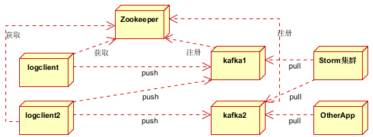
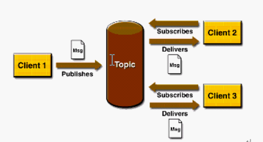
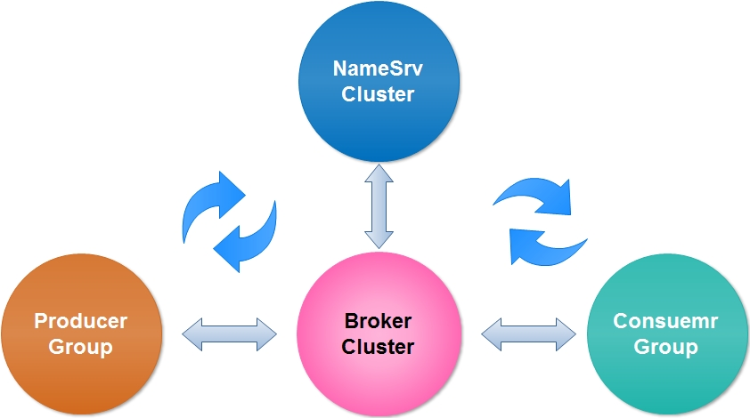

## 消息队列

消息队列中间件是分布式系统中重要的组件，主要解决异步处理，应用解耦，流量削锋和消息通讯，实现高性能，高可用，可伸缩和最终一致性架构。

使用较多的消息队列有ActiveMQ，RabbitMQ，ZeroMQ，Kafka，MetaMQ，RocketMQ。

### 消息中间件示例

#### 电商系统

消息队列采用高可用，可持久化的消息中间件。比如Active MQ，Rabbit MQ，Rocket Mq。

- 应用将主干逻辑处理完成后，写入消息队列。消息发送是否成功可以开启消息的确认模式。（消息队列返回消息接收成功状态后，应用再返回，这样保障消息的完整性）
- 扩展流程（发短信，配送处理）订阅队列消息。采用推或拉的方式获取消息并处理。
- 消息将应用解耦的同时，带来了数据一致性问题，可以采用最终一致性方式解决。比如主数据写入数据库，扩展应用根据消息队列，并结合数据库方式实现基于消息队列的后续处理。

#### 日志收集系统

分为Zookeeper注册中心，日志收集客户端，Kafka集群和Storm集群（OtherApp）四部分组成。

- Zookeeper注册中心，提出负载均衡和地址查找服务
- 日志收集客户端，用于采集应用系统的日志，并将数据推送到kafka队列
- Kafka集群：接收，路由，存储，转发等消息处理

Storm集群：与OtherApp处于同一级别，采用拉的方式消费队列中的数据。

新浪kafka日志处理应用案例

- Kafka：接收用户日志的消息队列
- Logstash：做日志解析，统一成JSON输出给Elasticsearch
- Elasticsearch：实时日志分析服务的核心技术，一个schemaless，实时的数据存储服务，通过index组织数据，兼具强大的搜索和统计功能
- Kibana：基于Elasticsearch的数据可视化组件，超强的数据可视化能力是众多公司选择ELK stack的重要原因

#### JMS消息服务

讲消息队列就不得不提JMS 。JMS（Java Message Service,Java消息服务）API是一个消息服务的标准/规范，允许应用程序组件基于JavaEE平台创建、发送、接收和读取消息。它使分布式通信耦合度更低，消息服务更加可靠以及异步性。

在EJB架构中，有消息bean可以无缝的与JM消息服务集成。在J2EE架构模式中，有消息服务者模式，用于实现消息与应用直接的解耦。

##### 消息模型

###### 消息模型

在JMS标准中，有两种消息模型P2P（Point to Point）,Publish/Subscribe(Pub/Sub)。

P2P模式

P2P模式包含三个角色：消息队列（Queue），发送者(Sender)，接收者(Receiver)。每个消息都被发送到一个特定的队列，接收者从队列中获取消息。队列保留着消息，直到他们被消费或超时。

P2P的特点

- 每个消息只有一个消费者（Consumer）(即一旦被消费，消息就不再在消息队列中)
- 发送者和接收者之间在时间上没有依赖性，也就是说当发送者发送了消息之后，不管接收者有没有正在运行，它不会影响到消息被发送到队列
- 接收者在成功接收消息之后需向队列应答成功 

如果希望发送的每个消息都会被成功处理的话，那么需要P2P模式。

Pub/sub模式

包含三个角色主题（Topic），发布者（Publisher），订阅者（Subscriber） 多个发布者将消息发送到Topic,系统将这些消息传递给多个订阅者。

Pub/Sub的特点

- 每个消息可以有多个消费者
- 发布者和订阅者之间有时间上的依赖性。针对某个主题（Topic）的订阅者，它必须创建一个订阅者之后，才能消费发布者的消息
- 为了消费消息，订阅者必须保持运行的状态

为了缓和这样严格的时间相关性，JMS允许订阅者创建一个可持久化的订阅。这样，即使订阅者没有被激活（运行），它也能接收到发布者的消息。

如果希望发送的消息可以不被做任何处理、或者只被一个消息者处理、或者可以被多个消费者处理的话，那么可以采用Pub/Sub模型。

#### 常用消息队列

一般商用的容器，比如WebLogic，JBoss，都支持JMS标准，开发上很方便。但免费的比如Tomcat，Jetty等则需要使用第三方的消息中间件。本部分内容介绍常用的消息中间件（Active MQ,Rabbit MQ，Zero MQ,Kafka）以及他们的特点。

##### ActiveMQ

ActiveMQ 是Apache出品，最流行的，能力强劲的开源消息总线。ActiveMQ 是一个完全支持JMS1.1和J2EE 1.4规范的 JMS Provider实现，尽管JMS规范出台已经是很久的事情了，但是JMS在当今的J2EE应用中间仍然扮演着特殊的地位。

ActiveMQ特性如下：

⒈ 多种语言和协议编写客户端。语言: Java,C,C++,C#,Ruby,Perl,Python,PHP。应用协议： OpenWire,Stomp REST,WS Notification,XMPP,AMQP

⒉ 完全支持JMS1.1和J2EE 1.4规范 （持久化，XA消息，事务)

⒊ 对spring的支持，ActiveMQ可以很容易内嵌到使用Spring的系统里面去，而且也支持Spring2.0的特性

⒋ 通过了常见J2EE服务器（如 Geronimo,JBoss 4,GlassFish,WebLogic)的测试，其中通过JCA 1.5 resource adaptors的配置，可以让ActiveMQ可以自动的部署到任何兼容J2EE 1.4 商业服务器上

⒌ 支持多种传送协议：in-VM,TCP,SSL,NIO,UDP,JGroups,JXTA

⒍ 支持通过JDBC和journal提供高速的消息持久化

⒎ 从设计上保证了高性能的集群，客户端-服务器，点对点

⒏ 支持Ajax

⒐ 支持与Axis的整合

⒑ 可以很容易得调用内嵌JMS provider，进行测试

##### RabbitMQ

RabbitMQ是流行的开源消息队列系统，用erlang语言开发。RabbitMQ是AMQP（高级消息队列协议）的标准实现。支持多种客户端，如：Python、Ruby、.NET、Java、JMS、C、PHP、ActionScript、XMPP、STOMP等，支持AJAX，持久化。用于在分布式系统中存储转发消息，在易用性、扩展性、高可用性等方面表现不俗。

结构图如下：

几个重要概念：

- Broker：简单来说就是消息队列服务器实体。
- Exchange：消息交换机，它指定消息按什么规则，路由到哪个队列。
- Queue：消息队列载体，每个消息都会被投入到一个或多个队列。
- Binding：绑定，它的作用就是把exchange和queue按照路由规则绑定起来。
- Routing Key：路由关键字，exchange根据这个关键字进行消息投递。
- vhost：虚拟主机，一个broker里可以开设多个vhost，用作不同用户的权限分离。
- producer：消息生产者，就是投递消息的程序。
- consumer：消息消费者，就是接受消息的程序。
- channel：消息通道，在客户端的每个连接里，可建立多个channel，每个channel代表一个会话任务。

消息队列的使用过程，如下：

1. 客户端连接到消息队列服务器，打开一个channel。
2. 客户端声明一个exchange，并设置相关属性。
3. 客户端声明一个queue，并设置相关属性。
4. 客户端使用routing key，在exchange和queue之间建立好绑定关系。
5. 客户端投递消息到exchange。

exchange接收到消息后，就根据消息的key和已经设置的binding，进行消息路由，将消息投递到一个或多个队列里。

##### ZeroMQ

号称史上最快的消息队列，它实际类似于Socket的一系列接口，他跟Socket的区别是：普通的socket是端到端的（1:1的关系），而ZMQ却是可以N：M 的关系，人们对BSD套接字的了解较多的是点对点的连接，点对点连接需要显式地建立连接、销毁连接、选择协议（TCP/UDP）和处理错误等，而ZMQ屏蔽了这些细节，让你的网络编程更为简单。ZMQ用于node与node间的通信，node可以是主机或者是进程。

引用官方的说法： “ZMQ(以下ZeroMQ简称ZMQ)是一个简单好用的传输层，像框架一样的一个socket library，他使得Socket编程更加简单、简洁和性能更高。是一个消息处理队列库，可在多个线程、内核和主机盒之间弹性伸缩。ZMQ的明确目标是“成为标准网络协议栈的一部分，之后进入Linux内核”。现在还未看到它们的成功。但是，它无疑是极具前景的、并且是人们更加需要的“传统”BSD套接字之上的一 层封装。ZMQ让编写高性能网络应用程序极为简单和有趣。”

特点是：

- 高性能，非持久化
- 跨平台：支持Linux、Windows、OS X等
- 多语言支持； C、C++、Java、.NET、Python等30多种开发语言
- 可单独部署或集成到应用中使用
- 可作为Socket通信库使用

与RabbitMQ相比，ZMQ并不像是一个传统意义上的消息队列服务器，事实上，它也根本不是一个服务器，更像一个底层的网络通讯库，在Socket API之上做了一层封装，将网络通讯、进程通讯和线程通讯抽象为统一的API接口。支持“Request-Reply “，”Publisher-Subscriber“，”Parallel Pipeline”三种基本模型和扩展模型。

ZeroMQ高性能设计要点：

1. 无锁的队列模型

   对于跨线程间的交互（用户端和session）之间的数据交换通道pipe，采用无锁的队列算法CAS；在pipe两端注册有异步事件，在读或者写消息到pipe的时，会自动触发读写事件。

2. 批量处理的算法

   对于传统的消息处理，每个消息在发送和接收的时候，都需要系统的调用，这样对于大量的消息，系统的开销比较大，zeroMQ对于批量的消息，进行了适应性的优化，可以批量的接收和发送消息。

3. 多核下的线程绑定，无须CPU切换

   区别于传统的多线程并发模式，信号量或者临界区， zeroMQ充分利用多核的优势，每个核绑定运行一个工作者线程，避免多线程之间的CPU切换开销。

##### Kafka

Kafka是一种高吞吐量的分布式发布订阅消息系统，它可以处理消费者规模的网站中的所有动作流数据。 这种动作（网页浏览，搜索和其他用户的行动）是在现代网络上的许多社会功能的一个关键因素。 这些数据通常是由于吞吐量的要求而通过处理日志和日志聚合来解决。 对于像Hadoop的一样的日志数据和离线分析系统，但又要求实时处理的限制，这是一个可行的解决方案。Kafka的目的是通过Hadoop的并行加载机制来统一线上和离线的消息处理，也是为了通过集群机来提供实时的消费。

Kafka是一种高吞吐量的分布式发布订阅消息系统，有如下特性：

- 通过O(1)的磁盘数据结构提供消息的持久化，这种结构对于即使数以TB的消息存储也能够保持长时间的稳定性能。（文件追加的方式写入数据，过期的数据定期删除）
- 高吞吐量：即使是非常普通的硬件Kafka也可以支持每秒数百万的消息
- 支持通过Kafka服务器和消费机集群来分区消息
- 支持Hadoop并行数据加载

Kafka相关概念

- Broker

Kafka集群包含一个或多个服务器，这种服务器被称为broker[5]

- opic

每条发布到Kafka集群的消息都有一个类别，这个类别被称为Topic。（物理上不同Topic的消息分开存储，逻辑上一个Topic的消息虽然保存于一个或多个broker上但用户只需指定消息的Topic即可生产或消费数据而不必关心数据存于何处）

- Partition

Parition是物理上的概念，每个Topic包含一个或多个Partition.

- Producer

负责发布消息到Kafka broker

- Consumer

消息消费者，向Kafka broker读取消息的客户端。

- Consumer Group

每个Consumer属于一个特定的Consumer Group（可为每个Consumer指定group name，若不指定group name则属于默认的group）。

##### RocketMQ

在RocketMQ里，有以下几个核心的模块：Producer，Consumer，Broker，NameSrv。他们之间的关系如下

rocketmq的主要部分是由4种集群构成的：namesrv集群、broker集群、producer集群和consumer集群。

- namesrv集群：也就是注册中心，rocketmq在注册中心这块没有使用第三方的中间件，而是自己写的代码来实现的，代码行数才1000行，producer、broker和consumer在启动时都需要向namesrv进行注册，namesrv服务之间不通讯。
- broker集群：broker提供关于消息的管理、存储、分发等功能，是消息队列的核心组件。rocket关于broker的集群提供了主要两种方案，一种是主从同步方案，消息同时写到master和slave服务器视为消息发送成功；另一种是异步方案，slave的异步服务负责读取master的数据，本人在选择时更倾向于异步方案。
- producer集群：消息的生产者，每个producer都需要属于一个group，producer的group概念除了在事务消息时起到一些作用，但是其它时候，更多的还只是一个虚拟的概念。
- consumer集群：消息的消费者，有两个主要的consumer:DefaultMQPullConsumer和DefaultMQPushConsumer，深入代码后可以发现，rocket的consumer都是采用的pull模式来处理消息的。在集群消息的配置下，集群内各个服务平均分配消息，当其中一台consumer宕机，分配给它的消息会继续分配给其它的consumer。

核心特性

1. 读队列数量和写队列数量可以不一致：当我们使用updateTopic命令创建topic时，会发现新建的topic下会有默认的8个写对列和8个读对列(依赖于配置)，并且读队列的数量和写队列的数量还可以不一致，这是为什么呢？难道在底层读写队列是在物理上分离的吗？抱着这个问题，我分析了相关的源代码，发现底层代码对于读写队列指的都是同一个队列，其中写队列的数量是针对的producer，读队列的数量针对的是consumer：

    a.假设写队列有8个、读队列有4个，那么producer产生的消息会按轮训的方式写入到8个队列中，但是consumer却只能消费前4个队列，只有把读队列重新设置为8后，consumer可以继续消费后4个队列的历史消息；

    b.假设写队列有4个、读队列有8个，那么producer产生的消息会按轮训的方式写入到4个队列中，但是consumer却能消费8个队列，只是后4个队列没有消息可以消费罢了。

2. 存储为文件存储方式，支持同步落盘和异步刷盘两种方式，我倾向于选择异步刷盘的方式，毕竟broker挂掉的概率比较小，大部分的业务场景下在极端情况下丢失及其少量消息是可以忍受的；
3. 支持消息回溯，支持定期删除历史消息；
4. 集群方案比activemq要优秀很多，支持多主多从方案，例如在2主2从异步架构下，a,b为master,as,bs为slaver，当a机宕机后，producer会将消息全部发往b机，consumer会消费as，b和bs上的消息，理论上只会丢失毫秒级别的消息，不会影响业务的正常使用。可以说rocketmq的集群方案完爆activemq的集群方案，很多时候，我们对于异步队列的性能要求不高，但是集群的可用性要求一定是很高的。下面是activemq的三种集群方案：

    a.磁盘阵列类，成本较高，也是一种通用的方案；

    b.利用jdbc来实现统一存储消息，不但性能成问题，而且也只是把问题丢给了数据库罢了，没有解决集群的单机问题；

    c.利用zookeeper的注册中心的选主功能，在各个服务之间同步数据，在实际的使用过程中发现主机自动漂移，同步数据不完全造成的数据错乱且服务启动不了，反而不如单机来的稳定；

5. 队列数量单机支持10000个以上；
6. consumer支持集群功能，可以平均消费消息，当有一台consumer宕机后，其它consumer继续均分；
7. consumer是靠pull的方式来消费消息的，性能不低于push的方式，这也是broker的并行能力强的一个原因，将主动权下放给了consumer，降低了broker的运算量和线程切换成本；
8. 支持顺序消息，可以在发送消息时，利用selector机制的hash方式取模来实现消息落到哪个broker的哪个queue上，当某个broker宕机后，由于取模值也发生变化，会自动切换队列；
9. producer发送消息时支持同步返回、异步返回和oneway三种方式；
10. broker保证每条消息至少投递到consumer一次，因此consumer的业务需要支持幂等；
11. 消息堆积能力惊人，消息队列的一个作用便是防止洪峰直接冲垮后端业务；
12. 支持按照消息id和消息key来查询消息，本人很喜欢按照key来查询消息这个功能，例如在下单业务中，可以使用订单id作为key，便于分析异常订单在系统中的处理过程；
13. 支持消息过滤；