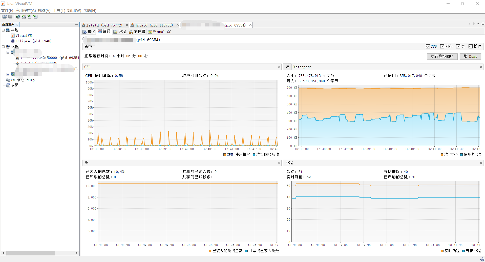
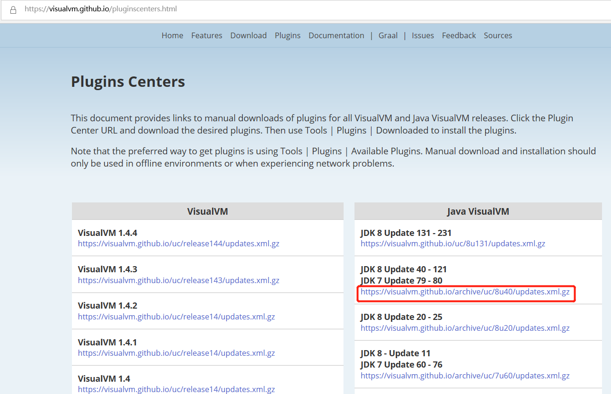
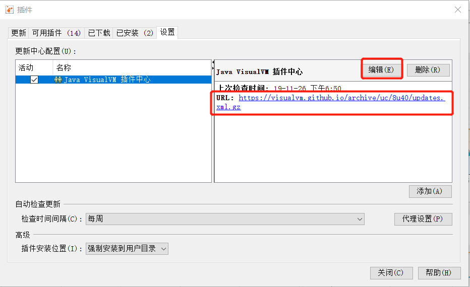
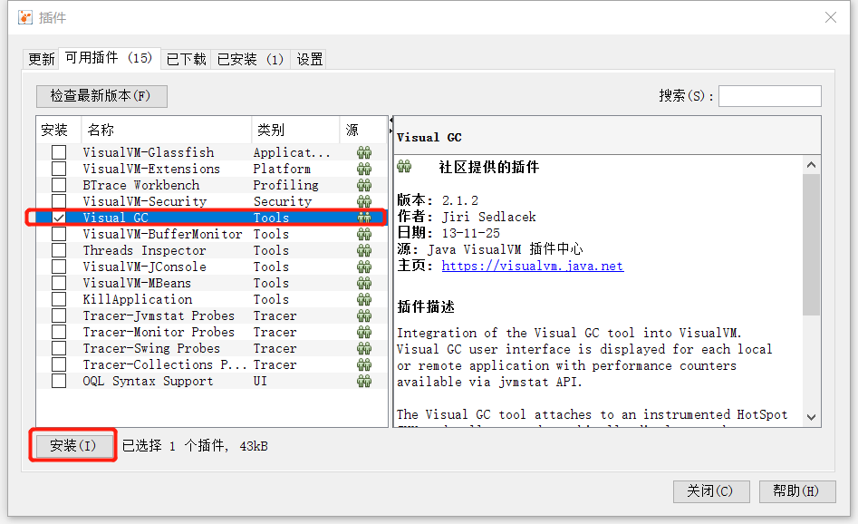

# 目录
* [jvisualvm介绍](#jvisualvm介绍)
* [jvisualvm使用](#jvisualvm使用)
    * [jvisualvm监控远程服务器](#jvisualvm监控远程服务器)
    * [jvisualvm集成Visual GC插件](#jvisualvm集成Visual-GC插件)
* [常见问题](#常见问题)
* [引用](#引用)

## jvisualvm介绍
    1. jvisualvm是JDK自带的可以远程监控内存，跟踪垃圾回收，执行时内存，CPU/线程分析，生成堆快照等的工具。
    2. jvisualvm是从JDK1.6开始被继承到JDK中的。

## jvisualvm使用

### jvisualvm监控远程服务器
`开启远程监控`
* 通过在服务器上设置jmx参数来开启
    ```
    vi /etc/profile
    export JAVA_OPTS='-Dcom.sun.management.jmxremote=true -Dcom.sun.management.jmxremote.port=N -Djava.rmi.server.hostname=x.x.x.x -Dcom.sun.management.jmxremote.ssl=false -Dcom.sun.management.jmxremote.authenticate=false'
    ```
* 通过启动jar命令开启
    ```
    java -Dcom.sun.management.jmxremote=true -Dcom.sun.management.jmxremote.port=N -Djava.rmi.server.hostname=x.x.x.x -Dcom.sun.management.jmxremote.ssl=false -Dcom.sun.management.jmxremote.authenticate=false -jar xxx.jar
    ```

`连接`
* 打开jvisualvm，在远程中添加需要监控的服务器，然后再在该服务器下添加jmx监控连接


### jvisualvm集成Visual-GC插件
`Visual GC插件安装`
* 到https://visualvm.github.io/pluginscenters.html去下载对应的Visual GC Plugins

    

* 更改visual-gc配置中心URL

    

* 安装Visual GC Plugin

    

`Visual GC正确开启步骤`
* 在远程主机上添加安全策略文件
    ```shell
    [root@localhost ~] touch jstatd.all.policy
    [root@localhost ~] vi jstatd.all.policy
    grant codebase "file:${java.home}/../lib/tools.jar" {
        permission java.security.AllPermission;
    };
    ```
    > 注意：如果没有配置JDK环境变量，file后需要添加tool.jar的绝对路径
* 在远程主机上启动监控
    ```shell
    [root@localhost ~] jstatd -J-Djava.security.policy=/xxx/jstatd.all.policy  -J-Djava.rmi.server.logCalls=true -J-Djava.rmi.server.hostname=xx.xx.xx.xx -p 1099
    ```
    * 参数说明
        * -J-Djava.rmi.server.logCalls=true 打开日志，便于排错
        * -J-Djava.rmi.server.hostname=xx.xx.xx.xx hostname是本机IP地址，确保client能访问到，另外查看本机的hosts是否有其他配置，这里有坑，具体参照常见问题中的[XXXX](#)
* 可以查看端口是否被正常监听
    ```shell
    [root@localhost ~]# lsof -i:1099
    COMMAND    PID USER   FD   TYPE  DEVICE SIZE/OFF NODE NAME
    jstatd  110703 root   15u  IPv6 7374636      0t0  TCP *:rmiregistry (LISTEN)
    jstatd  110703 root   17u  IPv6 7373817      0t0  TCP localhost:rmiregistry->x.x.x.x:62209 (ESTABLISHED)
    ```
* 使用visualvm连接
    * 添加jstatd连接，注意端口号和远程服务器开启的端口号保持一致
    > 注意：远程服务器端口要设置开放

* 参考视图


# 常见问题
* 开启OOM-dump
    ```shell
    nohup java -Dcom.sun.management.jmxremote=true -Dcom.sun.management.jmxremote.port=N -Djava.rmi.server.hostname=x.x.x.x -Dcom.sun.management.jmxremote.ssl=false -Dcom.sun.management.jmxremote.authenticate=false -XX:+HeapDumpOnOutOfMemoryError -jar xxx.jar -XX:HeapDumpPath=~/dumps/ > nohup.log 2>&1 &
    ```

* Visual GC提示"不受此JVM支持“
    ```log
    Could not create remote object
    access denied ("java.util.PropertyPermission" "java.rmi.server.ignoreSubClasses" "write")
    java.security.AccessControlException: access denied ("java.util.PropertyPermission" "java.rmi.server.ignoreSubClasses" "write")
        at java.security.AccessControlContext.checkPermission(AccessControlContext.java:472)
        at java.security.AccessController.checkPermission(AccessController.java:884)
        at java.lang.SecurityManager.checkPermission(SecurityManager.java:549)
        at java.lang.System.setProperty(System.java:792)
        at sun.tools.jstatd.Jstatd.main(Jstatd.java:139)
    ```
* Could not contact registry，指向的IP地址是一个其他的地址
    ```log
    [root@localdomain bin]# ./jstatd -J-Djava.security.policy=jstatd.all.policy
    Could not contact registry
    Connection refused to host: y.y.y.y; nested exception is:
            java.net.ConnectException: Connection refused
    java.rmi.ConnectException: Connection refused to host: y.y.y.y; nested exception is:
    ```
    > 注意：我在这里查看了远程机器的hosts，发现其配有一些其他的IP，将其删除后能够联通
* 快速定位导致cpu飙升的线程堆栈信息
    ```log
    top 首先通过top命令找到高负载的CPU，获取进程id
    top -p <进程id> 精确定位到cpu高的进程，然后按H键，查看该进程所有线程
        或者 top -p 进程id -H 查看进程下的线程
    printf "%x" 进程id 将进程号转化为16进制，注意把十六进制的大写字母转换为小写
    jstack 进程id > xxx.txt 导出日志，然后在日志中查找nid=转换后进程id
        或者 jstack 进程ID|grep -A 10 55a0   10表示这个线程所在行后面10行，55a0是进程ID转换后的十六进制
    ```
* 查看堆内存使用情况
    ```
    jps查看各个应用进程id
    jmap -heap java项目进程id
    jmap -histo 进程id > log.txt 查看此应用中各实例生成情况
    jmap -histo:live [pid] > log.txt 过滤存活的对象
    ```
* 查找代码死锁
    ```
    jstack 进程id > xxx.txt 导出日志
    搜索 deadlock 或者查 locked关键字找到发生死锁线程
    ```

# 引用
* [jvisualvm简要说明](https://blog.csdn.net/weixin_38750084/article/details/83314046)
* [jvisualvm 连接 jstatd 远程监控 jvm 或 Visual GC提示"不受此JVM支持“](https://blog.csdn.net/liupeifeng3514/article/details/78998161)
* [使用Java VisualVM监控远程JVM](https://www.jianshu.com/p/2a6658e94ae2)
* [Visualvm 远程测试 问题](https://www.cnblogs.com/kentyshang/archive/2009/08/20/1550745.html)
* [visualgc - Visual Garbage Collection Monitoring Tool](https://www.oracle.com/technetwork/java/visualgc-136680.html)