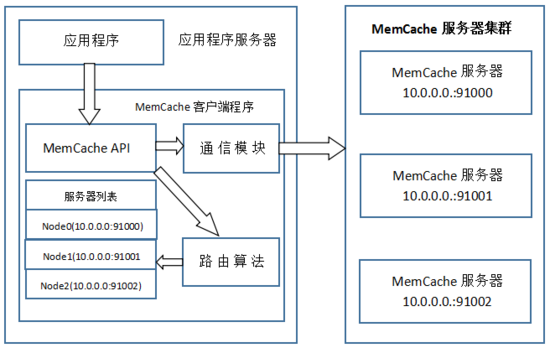

##MemCache超详细解读

MemCache是什么

MemCache是一个自由、源码开放、高性能、分布式的分布式内存对象缓存系统，用于动态Web应用以减轻数据库的负载。它通过在内存中缓存数据和对象来减少读取数据库的次数，从而提高了网站访问的速度。MemCaChe是一个存储键值对的HashMap，在内存中对任意的数据（比如字符串、对象等）所使用的key-value存储，数据可以来自数据库调用、API调用，或者页面渲染的结果。MemCache设计理念就是小而强大，它简单的设计促进了快速部署、易于开发并解决面对大规模的数据缓存的许多难题，而所开放的API使得MemCache能用于Java、C/C++/C#、Perl、Python、PHP、Ruby等大部分流行的程序语言。

另外，说一下MemCache和MemCached的区别：

1、MemCache是项目的名称

2、MemCached是MemCache服务器端可以执行文件的名称

MemCache的官方网站为 [http://memcached.org/](http://memcached.org/)

###MemCache访问模型

为了加深理解，我模仿着原阿里技术专家李智慧老师《大型网站技术架构 核心原理与案例分析》一书MemCache部分，自己画了一张图：

特别澄清一个问题， MemCache虽然被称为"分布式缓存"，但是MemCache本身完全不具备分布式的功能 ，MemCache集群之间不会相互通信（与之形成对比的，比如JBoss Cache，某台服务器有缓存数据更新时，会通知集群中其他机器更新缓存或清除缓存数据），所谓的"分布式"，完全依赖于客户端程序的实现，就像上面这张图的流程一样。 

同时基于这张图，理一下MemCache一次写缓存的流程：

1. 应用程序输入需要写缓存的数据

2. API将Key输入路由算法模块，路由算法根据Key和MemCache集群服务器列表得到一台服务器编号

3. 由服务器编号得到MemCache及其的ip地址和端口号

4. API调用通信模块和指定编号的服务器通信，将数据写入该服务器，完成一次分布式缓存的写操作

读缓存和写缓存一样，只要使用相同的路由算法和服务器列表，只要应用程序查询的是相同的Key，MemCache客户端总是访问相同的客户端去读取数据，只要服务器中还缓存着该数据，就能保证缓存命中。

这种MemCache集群的方式也是从分区容错性的方面考虑的，假如Node2宕机了，那么Node2上面存储的数据都不可用了，此时由于集群中Node0和Node1还存在，下一次请求Node2中存储的Key值的时候，肯定是没有命中的，这时先从数据库中拿到要缓存的数据，然后路由算法模块根据Key值在Node0和Node1中选取一个节点，把对应的数据放进去，这样下一次就又可以走缓存了，这种集群的做法很好，但是缺点是成本比较大。